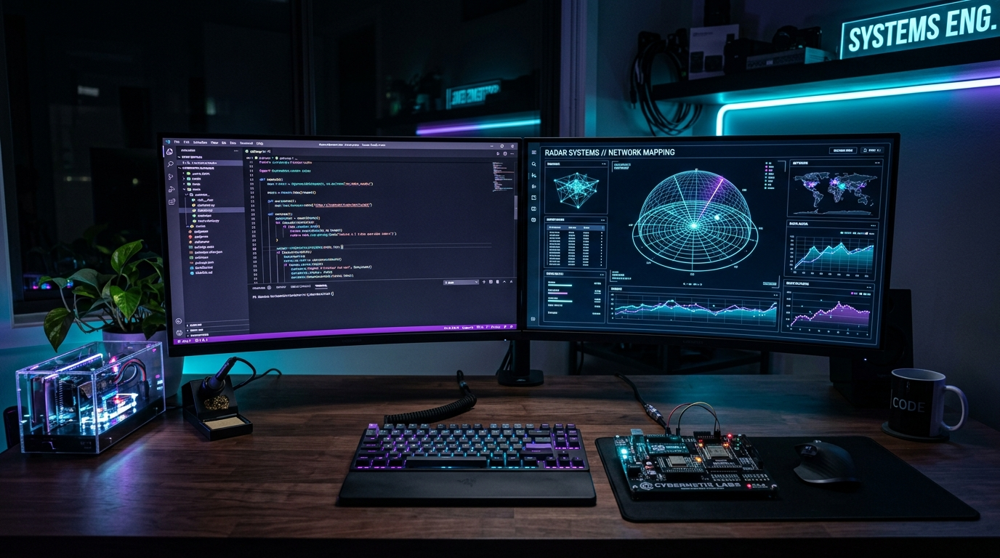

  <!-- ─── 8K HIGH-TECH DEVELOPER WORKSPACE BANNER ─── -->
  

    

  <!-- ─── DYNAMIC TYPING TITLE ─── -->
  

  
<b>Electronics & Communication Engineering @ Panimalar Engineering College</b>

  <!-- ─── QUICK BADGES ─── -->
  

    
    &nbsp;
    
    &nbsp;
    
  

---

### 💼 About Me & Engineering Philosophy
- 🔬 **Systems & Full-Stack Architect:** Designing low-latency IoT embedded systems, real-time 3D WebGL interfaces, and secure cloud platforms.
- ⚡ **Core Technologies:** React, TypeScript, Three.js, Node.js, Express, MongoDB, ESP32, Arduino, and Python.
- 🎯 **Mission:** Building practical, life-saving hardware and interactive digital experiences.

---

### 🚀 Complete Project Portfolio

<table>
  <tr>
    <td width="50%" valign="top">
      <h3>🛰️ A.U.R.A. System (SIH 2026)</h3>
      
<b>Sub-Surface Life & Cavity Detection System</b>

      
Autonomous hardware platform for disaster rescue. Combines 40 kHz ultrasonic Time-of-Flight radar, SM-24 piezoelectric geophones, NEO-6M satellite telemetry, and an interactive 3D WebGL tactical HUD.

      
<code>TypeScript</code> • <code>Three.js</code> • <code>React</code> • <code>ESP32</code> • <code>LoRa SX1262</code>

      
<a href="https://github.com/jafferrilwaan-png/A.U.R.A-System"><b>➔ View A.U.R.A. System Repository</b></a>

    </td>
    <td width="50%" valign="top">
      <h3>🏎️ Porsche 911 3D Showcase</h3>
      
<b>Interactive 3D WebGL Vehicle Experience</b>

      
A high-performance 3D visualization showcase featuring real-time shader lighting, camera controls, and procedural material rendering for the iconic Porsche 911.

      
<code>JavaScript</code> • <code>Three.js</code> • <code>WebGL</code> • <code>Tailwind CSS</code>

      
<a href="https://github.com/jafferrilwaan-png/porsche-911-3d-showcase"><b>➔ View Porsche 3D Repository</b></a>

    </td>
  </tr>
  <tr>
    <td width="50%" valign="top">
      <h3>🏥 AXON — Healthcare Platform</h3>
      
<b>Efficient Digital Health & Medical Records System</b>

      
A streamlined, secure web application engineered for centralized healthcare records management, patient telemetry tracking, and hospital workflow optimization.

      
<code>TypeScript</code> • <code>React</code> • <code>Node.js</code> • <code>MongoDB</code>

      
<a href="https://github.com/jafferrilwaan-png/AXON"><b>➔ View AXON Repository</b></a>

    </td>
    <td width="50%" valign="top">
      <h3>🔥 Agni Paravai</h3>
      
<b>High-Performance Full-Stack Web Platform</b>

      
A robust modern web platform designed with modular architecture, high-concurrency event handling, and clean responsive UI design.

      
<code>TypeScript</code> • <code>React</code> • <code>Tailwind CSS</code> • <code>Vite</code>

      
<a href="https://github.com/jafferrilwaan-png/agni-paravai"><b>➔ View Agni Paravai Repository</b></a>

    </td>
  </tr>
  <tr>
    <td width="50%" valign="top">
      <h3>🔊 Silent Voice</h3>
      
<b>Assistive Speech & Communication Accessibility System</b>

      
Assistive communication portal empowering individuals with speech impairments to communicate smoothly through real-time voice synthesis and interactive visual UI cards.

      
<code>JavaScript</code> • <code>Web Speech API</code> • <code>Modern CSS</code>

      
<a href="https://github.com/jafferrilwaan-png/silent-voice"><b>➔ View Silent Voice Repository</b></a>

    </td>
    <td width="50%" valign="top">
      <h3>📊 CGPA Calculator</h3>
      
<b>Precision Academic Analytics & GPA Predictor</b>

      
Academic grading calculator providing semester-by-semester grade point calculations, target grade forecasting, and dynamic chart visualizations.

      
<code>React</code> • <code>Vite</code> • <code>Tailwind CSS</code> • <code>JavaScript</code>

      
<a href="https://github.com/jafferrilwaan-png/cgpa-calculator"><b>➔ View CGPA Calculator Repository</b></a>

    </td>
  </tr>
  <tr>
    <td colspan="2" valign="top">
      <h3>🌉 Freedom Bridge</h3>
      
<b>Full-Stack Collaboration & Utility Hub</b>

      
A collaborative glassmorphic web application offering real-time community tools, modular database structures, and seamless user interaction.

      
<code>Node.js</code> • <code>Express</code> • <code>MongoDB</code> • <code>React</code>

      
<a href="https://github.com/jafferrilwaan-png"><b>➔ View Freedom Bridge Platform</b></a>

    </td>
  </tr>
</table>

---

### ⚡ Live Dynamic GitHub Contributions

  

---

### 🛠️ Hardware & Software Arsenal

  #### 🌐 Frontend & 3D WebGL
  

    

  #### ⚙️ Backend, Systems & Database
  

    

  #### 📡 Embedded Hardware, IoT & Microcontrollers
  

---

   
  Designed with ⚡ by <b>Jaffer Rilwaan V</b> • Systems Architect & Full-Stack Engineer

