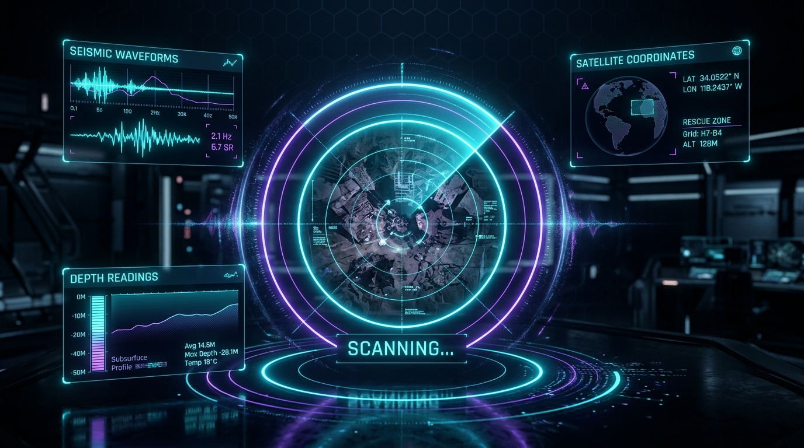
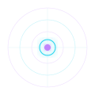
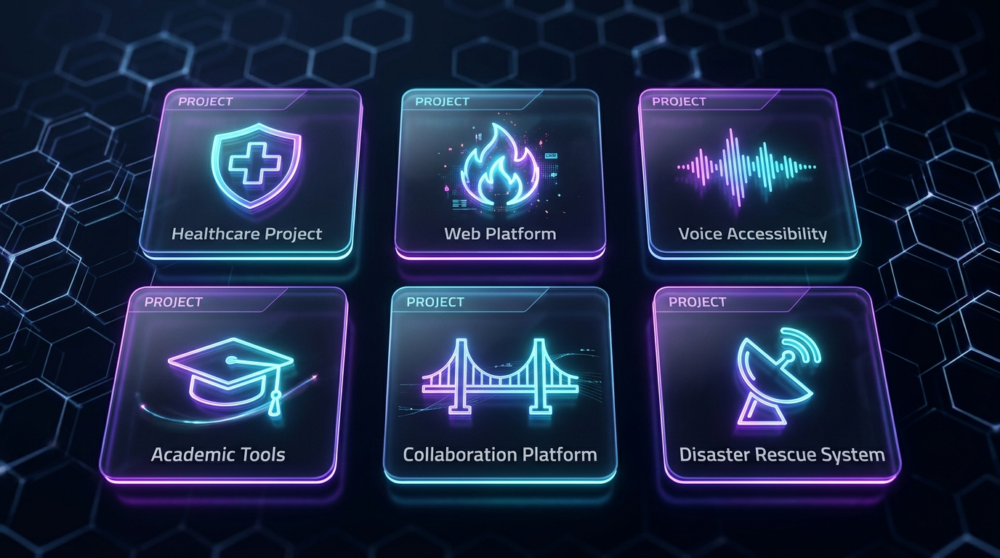
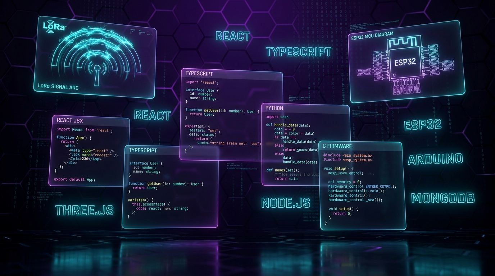
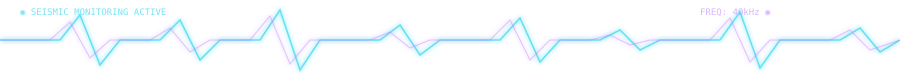

<div align="center">

<!-- ████████████████████████████████████████████████████████████
     SECTION 1: CINEMATIC AURA RADAR BANNER
     ████████████████████████████████████████████████████████████ -->



<br/>

<!-- ████████████████████████████████████████████████████████████
     SECTION 2: ANIMATED NEON TYPING IDENTITY
     ████████████████████████████████████████████████████████████ -->


<br/>


<br/>

<p><b>🎓 Electronics & Communication Engineering — Panimalar Engineering College</b></p>

<!-- SOCIAL BADGES -->
<p align="center">
  <a href="https://www.linkedin.com/in/jaffer-rilwaan-b4b803386" target="_blank">
    
  </a>
  &nbsp;
  <a href="mailto:tactical@aurasystem.dev">
    
  </a>
  &nbsp;
  <a href="https://github.com/jafferrilwaan-png?tab=repositories">
    
  </a>
  &nbsp;
  
</p>

</div>

<!-- ████ ANIMATED PULSE DIVIDER ████ -->


---

<div align="center">

<!-- ████████████████████████████████████████████████████████████
     SECTION 3: RADAR SPINNER + ENGINEERING MANIFEST
     ████████████████████████████████████████████████████████████ -->



</div>

### 📡 Systems Engineering Manifest

```yaml
╔══════════════════════════════════════════════════════════════════╗
║  ROLE          : Lead Systems Architect & Full-Stack IoT Engineer ║
║  HARDWARE      : ESP32 Dual-Core • SX1262 LoRa • SM-24 Geophones ║
║  FIRMWARE      : C/C++ Real-Time Sensor DSP & Telemetry Pipelines ║
║  FRONTEND      : React • TypeScript • Three.js 3D WebGL HUDs      ║
║  BACKEND       : Node.js • Express • MongoDB • REST APIs           ║
║  MISSION       : Engineering disaster rescue & healthcare systems  ║
║  STATUS        : ⚡ Active — Compiling Firmware & Scaling Systems  ║
╚══════════════════════════════════════════════════════════════════╝
```

<!-- ████ ANIMATED PULSE DIVIDER ████ -->


---

<!-- ████████████████████████████████████████████████████████████
     SECTION 4: PROJECT SHOWCASE HEADER IMAGE
     ████████████████████████████████████████████████████████████ -->

<div align="center">

</div>

### 🚀 Complete Project Arsenal — 7 Live Deployments

<table>
  <tr>
    <td width="50%" valign="top">
      <h3>🛰️ A.U.R.A. — Autonomous Underground Rescue Array</h3>
      <p><b>Sub-Surface Cavity & Survivor Detection System (SIH 2026)</b></p>
      <p>Full autonomous hardware-software platform for collapsed-structure search and rescue. Active 40 kHz ultrasonic ToF arrays, SM-24 piezoelectric geophone signal processing, NEO-6M GPS satellite telemetry, and a 3D WebGL tactical operations HUD with live sensor data visualization.</p>
      <p>
        
        
        
        
      </p>
      <p><a href="https://github.com/jafferrilwaan-png/A.U.R.A-System"><b>🔗 Explore A.U.R.A. System →</b></a></p>
    </td>
    <td width="50%" valign="top">
      <h3>🏥 AXON — Healthcare Digital Platform</h3>
      <p><b>Centralized Electronic Health Records & Patient Telemetry</b></p>
      <p>A high-performance, secure medical web application for centralized patient records management, real-time vital sign telemetry analytics, and efficient hospital workflow orchestration with high-speed database indexing.</p>
      <p>
        
        
        
        
      </p>
      <p><a href="https://github.com/jafferrilwaan-png/AXON"><b>🔗 Explore AXON Platform →</b></a></p>
    </td>
  </tr>
  <tr>
    <td width="50%" valign="top">
      <h3>🔥 Agni Paravai — Web Platform</h3>
      <p><b>High-Performance Reactive Full-Stack Application</b></p>
      <p>A scalable, high-concurrency modern web platform built with modular component architecture, reactive state management, and a sleek glassmorphic dark UI designed for high-speed user interaction.</p>
      <p>
        
        
        
        
      </p>
      <p><a href="https://github.com/jafferrilwaan-png/agni-paravai"><b>🔗 Explore Agni Paravai →</b></a></p>
    </td>
    <td width="50%" valign="top">
      <h3>🔊 Silent Voice — Accessibility System</h3>
      <p><b>Assistive Communication for Speech-Impaired Individuals</b></p>
      <p>An assistive communication portal that empowers individuals with speech impairments to express themselves through real-time voice synthesis, customizable phrase cards, and an intuitive, inclusive interface.</p>
      <p>
        
        
        
        
      </p>
      <p><a href="https://github.com/jafferrilwaan-png/silent-voice"><b>🔗 Explore Silent Voice →</b></a></p>
    </td>
  </tr>
  <tr>
    <td width="50%" valign="top">
      <h3>📊 CGPA Calculator — Academic Analytics</h3>
      <p><b>Precision Grade Tracking & Semester Performance Predictor</b></p>
      <p>A clean, fast academic performance calculator providing weighted GPA computation, target-grade forecasting across semesters, and interactive data chart visualizations for students.</p>
      <p>
        
        
        
        
      </p>
      <p><a href="https://github.com/jafferrilwaan-png/cgpa-calculator"><b>🔗 Explore CGPA Calculator →</b></a></p>
    </td>
    <td width="50%" valign="top">
      <h3>🌉 Freedom Bridge — Collaboration Hub</h3>
      <p><b>Full-Stack Community & Utility Platform</b></p>
      <p>A collaborative social-utility web application with modern dark glassmorphic UI, secure JWT-based authentication, real-time community features, and scalable NoSQL database architecture.</p>
      <p>
        
        
        
        
      </p>
      <p><a href="https://github.com/jafferrilwaan-png"><b>🔗 Explore Freedom Bridge →</b></a></p>
    </td>
  </tr>
  <tr>
    <td colspan="2" valign="top" align="center">
      <h3>🔗 Agni Paravai (Extended Build)</h3>
      <p><b>Extended architecture version with enhanced data pipeline and performance optimizations.</b></p>
      <p>
        
        
        
      </p>
      <p><a href="https://github.com/jafferrilwaan-png/agni-paravais"><b>🔗 Explore Extended Build →</b></a></p>
    </td>
  </tr>
</table>

<!-- ████ ANIMATED PULSE DIVIDER ████ -->


---

<!-- ████████████████████████████████████████████████████████████
     SECTION 5: TECH STACK VISUAL + SKILL ICONS
     ████████████████████████████████████████████████████████████ -->

<div align="center">

</div>

### 🛠️ Complete Hardware & Software Arsenal

<div align="center">

**🌐 Frontend, 3D WebGL & UI**
<br/>


<br/><br/>

**⚙️ Backend, Systems & Databases**
<br/>


<br/><br/>

**📡 Embedded Hardware, IoT & DevOps**
<br/>


</div>

<!-- ████ ANIMATED PULSE DIVIDER ████ -->


---

<!-- ████████████████████████████████████████████████████████████
     SECTION 6: LIVE ANALYTICS
     ████████████████████████████████████████████████████████████ -->

### ⚡ Live GitHub Contribution Analytics

<div align="center">
  
</div>

<!-- ████ ANIMATED SEISMIC WAVE FOOTER ████ -->


---

<div align="center">
  <sub>⚡ Systems designed & engineered by <b>Jaffer Rilwaan V</b> — Lead Systems Architect • Full-Stack & IoT Engineer</sub>
</div>
