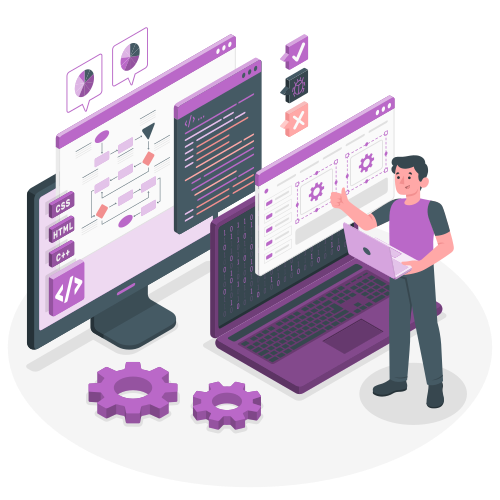
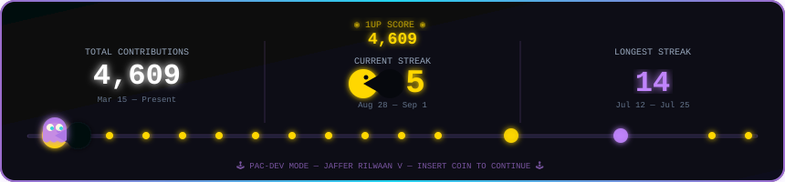

<div align="center">

<!-- ══════════ ANIMATED TYPING HEADER ══════════ -->


<p><b>🎓 Electronics & Communication Engineering — Panimalar Engineering College</b></p>

<p align="center">
  <a href="https://www.linkedin.com/in/jaffer-rilwaan-b4b803386">
    
  </a>&nbsp;
  <a href="mailto:tactical@aurasystem.dev">
    
  </a>&nbsp;
  <a href="https://github.com/jafferrilwaan-png?tab=repositories">
    
  </a>&nbsp;
  
</p>

<p align="center">
  <a href="./bumblebee_robot_transformers_human_alliance/scene.gltf">
    
  </a>&nbsp;
  <a href="./bumblebee_robot_transformers_human_alliance">
    
  </a>
</p>

</div>


---

<!-- ══════════════════════════════════════════════════════════
     🧑‍💻 THE ENGINEER BEHIND THE CODE
══════════════════════════════════════════════════════════ -->

### 🧑‍💻 The Engineer Behind The Code

<table>
  <tr>
    <td width="50%" align="center">
      
      <br/>
      <sub><b>⚡ Systems Architect</b> — Full-Stack & IoT Engineering</sub>
    </td>
    <td width="50%" align="center">
      
      <br/>
      <sub><b>🛰️ Embedded Hardware</b> — ESP32 & Sensor Firmware</sub>
    </td>
  </tr>
  <tr>
    <td width="50%" align="center">
      
      <br/>
      <sub><b>🌐 Frontend Engineer</b> — React, Three.js & WebGL</sub>
    </td>
    <td width="50%" align="center">
      
      <br/>
      <sub><b>🏗️ Backend Architect</b> — Node.js, MongoDB & APIs</sub>
    </td>
  </tr>
</table>


---

<!-- ══════════ SYSTEMS ENGINEERING MANIFEST ══════════ -->

<div align="center">

</div>

### 📡 Systems Engineering Manifest

```yaml
╔════════════════════════════════════════════════════════════════════╗
║  ROLE       : Lead Systems Architect & Full-Stack IoT Engineer     ║
║  HARDWARE   : ESP32 Dual-Core • SX1262 LoRa Mesh • Sensor Telemetry║
║  FIRMWARE   : C/C++ Real-Time Embedded DSP & Satellite Comms       ║
║  FRONTEND   : React 18 • TypeScript • Three.js 3D WebGL HUDs       ║
║  BACKEND    : Node.js • Express REST APIs • MongoDB • Python       ║
║  MISSION    : Transit tech, healthcare AI, assistive engineering   ║
║  STATUS     : ⚡ Active — Compiling Firmware & Scaling Production  ║
╚════════════════════════════════════════════════════════════════════╝
```


---

<!-- ══════════ PROJECTS ARSENAL ══════════ -->

<div align="center">

</div>

### 🚀 Complete Project Arsenal — Live Deployments

<table>
  <tr>
    <td width="50%" valign="top">
      <h3>🔥 Agni Paravai — Web Platform</h3>
      <b>High-Performance Reactive Full-Stack Web Platform</b>
      <p>Modern reactive web platform with modular component architecture, dynamic state synchronization, and glassmorphic dark UI.</p>
      <p>
        
        
        
        
      </p>
      <a href="https://github.com/jafferrilwaan-png/agni-paravai"><b>🔗 Repository →</b></a>&nbsp;&nbsp;|&nbsp;&nbsp;<a href="https://agni-paravai-87q6.vercel.app/"><b>🚀 Live App →</b></a>
    </td>
    <td width="50%" valign="top">
      <h3>🏥 AXON — Healthcare Platform</h3>
      <b>Centralized EHR & Real-Time Patient Telemetry</b>
      <p>Secure clinical management web application for centralized electronic health records, patient vital sign analytics, and hospital workflow orchestration.</p>
      <p>
        
        
        
        
      </p>
      <a href="https://github.com/jafferrilwaan-png/AXON"><b>🔗 Repository →</b></a>&nbsp;&nbsp;|&nbsp;&nbsp;<a href="https://axon-lac-psi.vercel.app"><b>🚀 Live App →</b></a>
    </td>
  </tr>
  <tr>
    <td width="50%" valign="top">
      <h3>🚍 Panimalar Transport & Fleet Management</h3>
      <b>Transit Scheduling, Dispatching & Logistics Management</b>
      <p>Enterprise institutional logistics system for real-time bus route tracking, vehicle fleet status monitoring, and driver dispatch orchestration.</p>
      <p>
        
        
        
        
      </p>
      <a href="https://github.com/jafferrilwaan-png/panimalar-transport-system"><b>🔗 Repository →</b></a>&nbsp;&nbsp;|&nbsp;&nbsp;<a href="https://pbtspanimalar.vercel.app/"><b>🚀 Live App →</b></a>
    </td>
    <td width="50%" valign="top">
      <h3>🎓 Student Perks Hub — Campus Utility</h3>
      <b>Student Benefits, Discount Verification & Community Portal</b>
      <p>Exclusive collegiate utility platform providing authenticated student privilege access, campus merchant discounts, and student service directories.</p>
      <p>
        
        
        
      </p>
      <a href="https://github.com/jafferrilwaan-png/student-perks-hub"><b>🔗 Repository →</b></a>&nbsp;&nbsp;|&nbsp;&nbsp;<a href="https://student-perks-hub-aj58.vercel.app/"><b>🚀 Live App →</b></a>
    </td>
  </tr>
  <tr>
    <td width="50%" valign="top">
      <h3>🔊 Silent Voice — Assistive Speech System</h3>
      <b>Assistive Communication for Speech-Impaired Individuals</b>
      <p>Inclusive accessibility portal enabling individuals with speech impairments to synthesize natural vocal communication through an intuitive symbol interface.</p>
      <p>
        
        
        
      </p>
      <a href="https://github.com/jafferrilwaan-png/silent-voice"><b>🔗 Repository →</b></a>&nbsp;&nbsp;|&nbsp;&nbsp;<a href="https://silent-voice-gamma.vercel.app"><b>🚀 Live App →</b></a>
    </td>
    <td width="50%" valign="top">
      <h3>📊 CGPA Calculator — Academic Analytics</h3>
      <b>Precision Grade Tracking & Semester Forecast Engine</b>
      <p>Academic grade calculation suite featuring weighted GPA algorithms, future grade forecasting targets, and interactive visual trend analysis.</p>
      <p>
        
        
        
      </p>
      <a href="https://github.com/jafferrilwaan-png/cgpa-calculator"><b>🔗 Repository →</b></a>&nbsp;&nbsp;|&nbsp;&nbsp;<a href="https://cgpa-calculator-umber.vercel.app"><b>🚀 Live App →</b></a>
    </td>
  </tr>
  <tr>
    <td width="50%" valign="top">
      <h3>🦇 Gotham's Table — Culinary & Menu Platform</h3>
      <b>Interactive Themed Dining & Digital Menu System</b>
      <p>Dark-aesthetic culinary web application featuring dynamic menu curation, interactive orders, and responsive UI design.</p>
      <p>
        
        
        
      </p>
      <a href="https://github.com/jafferrilwaan-png/gotham-s-table"><b>🔗 Repository →</b></a>
    </td>
    <td width="50%" valign="top">
      <h3>🛍️ DV Collection — E-Commerce & Catalog</h3>
      <b>Full-Stack Dynamic Product Catalog & Showcase Architecture</b>
      <p>Modern product display and catalog management application engineered with modular data schemas, responsive state handling, and dynamic component rendering.</p>
      <p>
        
        
        
      </p>
      <a href="https://github.com/jafferrilwaan-png/dvcollection"><b>🔗 Repository →</b></a>
    </td>
  </tr>
</table>


---

<!-- ══════════ LIVE GITHUB ANALYTICS ══════════ -->

### ⚡ Live GitHub Analytics

<div align="center">



<br/><br/>



<br/><br/>



</div>


---

<!-- ══════════ TECH STACK ARSENAL ══════════ -->

<div align="center">

</div>

### 🛠️ Complete Hardware & Software Arsenal

<div align="center">

**🌐 Frontend, 3D WebGL & UI Engineering**
<br/>


<br/><br/>

**⚙️ Backend, Systems & Databases**
<br/>


<br/><br/>

**📡 Embedded Hardware, IoT & DevOps**
<br/>


</div>


---

<div align="center">
  <sub>⚡ Designed & engineered by <b>Jaffer Rilwaan V</b> — Lead Systems Architect • Full-Stack & IoT Engineer</sub>
</div>
